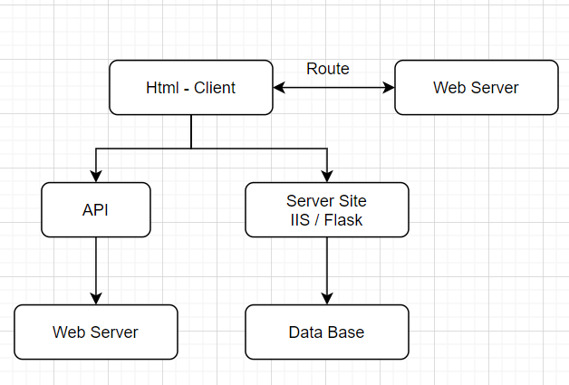

[Home](README.md)

網頁 Chart 元件 Web Chart [jqueryDataTable](https://datatables.net/) [plotjs](https://plotly.com/graphing-libraries/) [chartjs](https://www.chartjs.org/samples/latest/) 

網頁基本架構 

'''python

'''

