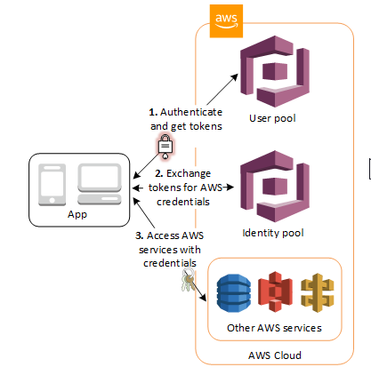

AWS Congito & Flask

[aws cognito doc](https://docs.aws.amazon.com/zh_tw/cognito/latest/developerguide/what-is-amazon-cognito.html) 

[Faksk Congito]([Flask-Cognito · PyPI](https://pypi.org/project/Flask-Cognito/)) 

兩個套件 boot3 & Flask-Cognito

[設定適用於 JavaScript 的 AWS SDK](http://docs.aws.amazon.com/sdk-for-javascript/v2/developer-guide/setting-up.html) [設定適用於 .NET 和 Xamarin 的 AWS Mobile SDK](http://docs.aws.amazon.com/mobile/sdkforxamarin/developerguide/index.html) 

------

[aws-ampifity SKD](https://github.com/aws-amplify/amplify-js/tree/master/packages/amazon-cognito-identity-js) 

[Cognito with js and flask tutorial ](https://www.youtube.com/watch?v=qMtk4LJ5OfE&t=9s&ab_channel=BojanBaltic) 